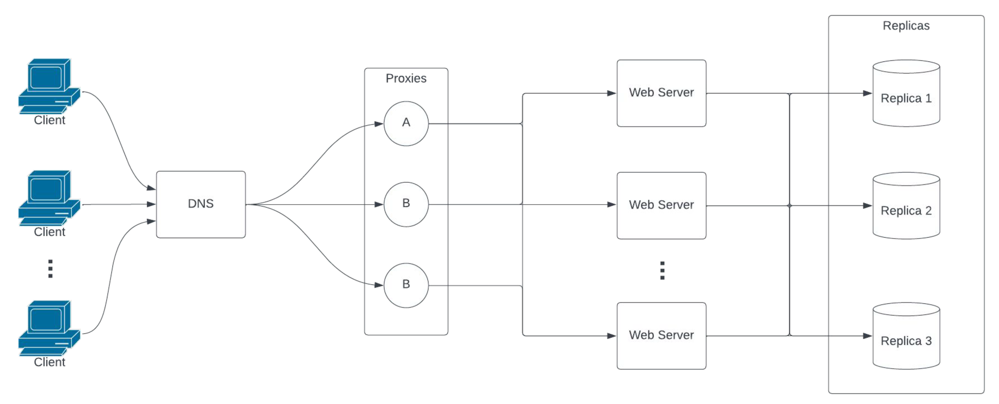
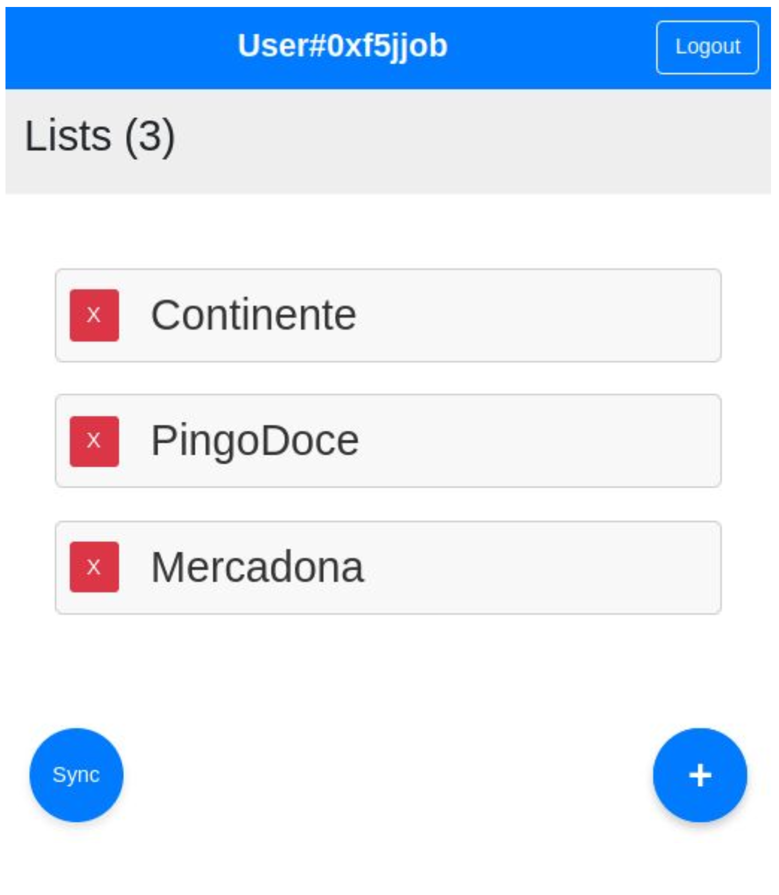
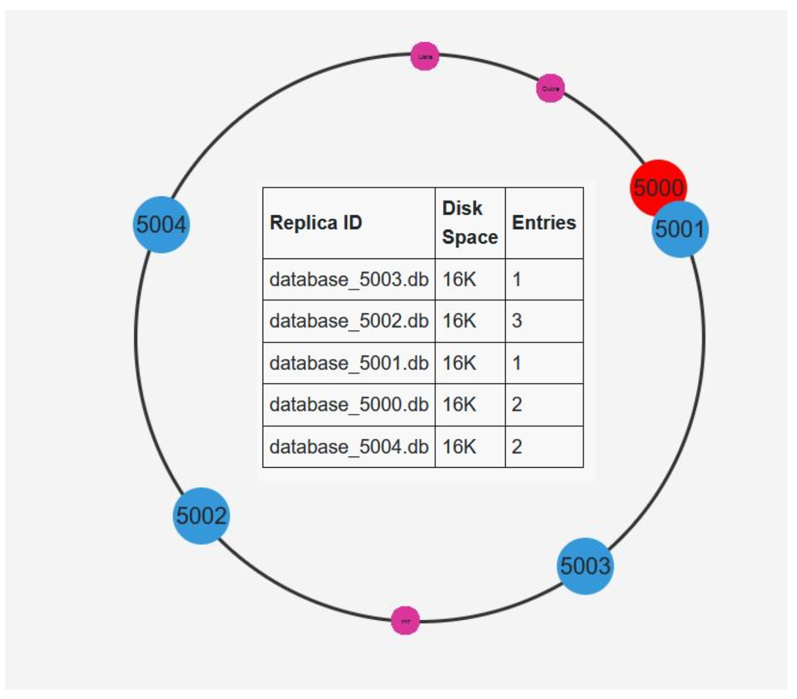

# Local-First Shopping List Application 🛒

## Description

A local-first, distributed shopping list application designed with high availability, fault tolerance, and collaborative features inspired by Amazon’s Dynamo architecture.

Video of the project:

[](https://www.youtube.com/watch?v=LzP8wQ8Kcpg)

See also our presentation slides [here](presentation.pdf).

## 📌 Features
- ✅ Create and manage multiple shopping lists
- 📝 Add, update quantities, and check off items
- 🔗 Share lists via unique URLs for collaboration
- 📶 Works fully offline with a local-first approach
- 🔄 Seamless sync and conflict-free collaboration via CRDTs
- 👥 Real-time collaborative editing
- ⚙️ Dynamic load balancing and high availability
- 💥 Fault-tolerant and scalable infrastructure

## 🏗️ Architecture
- **Local-First Design:** Full offline functionality with local data persistence
- **Cloud Sync:** Automatic backup and sync using a custom delta-based CRDT
- **High Availability:** Scales horizontally with quorum-based consistency, hinted handoff, and replication
- **Data Partitioning:** Each list is stored independently using consistent hashing and replica rings
- **Dynamic Load Balancing:** Based on DNS routing and response time
- **Fault Tolerance:** Proxy servers, DNS, and garbage collection support availability and recovery

## ⚙️ System Components
- **Shopping List Management:** Create, edit, and share lists via unique URLs
- **Item Management:** Add/remove items, update quantities, and check them off
- **Collaboration Engine:** Real-time updates with CRDT-based conflict resolution
- **Admin Panel:** Monitor system health and performance
- **Support Utilities:** Includes proxy servers, DNS, hinted handoff, and garbage collection to ensure availability and efficiency

## Visualization


*Figure 1: System architecture showing local-first design, cloud sync, proxies, DNS, replica rings, and load balancing.*


*Figure 2: Main shopping list interface with item management and collaborative features.*


*Figure 3: Admin panel displaying system health, performance metrics, and network status.*

## Technologies

For the frontend, the team used `JavaScript`, `HTML` and `CSS`.
For the network and backend, the team used `Node.js` with `express` and `SQLite3`.

## How to run

To run the application, run the command below:

```bash
npm run start
```

The application will be served on live server at:

- `http://localhost:9000` - for the client 1
- `http://localhost:9001` - for the client 2
- `http://localhost:9002` - for admin panel

### Dependencies

On the first run, or after making changes to the `package.json` file, run the command below to install the dependencies:

```bash
npm install
```

### Troubleshooting

Sometimes the application is not stopped properly and the ports are still in use. To solve this problem, run the command below:

```bash
npm run kill
```

This command will kill all processes running.

### Ports used

For the emulation of a full network, the following ports are used:

Frontend:

- `9000` - client 1
- `9001` - client 2
- `9002` - admin panel

Network:

- `[4000-4002]` - proxies (3 instances)
- `5900` - DNS server

Backend:

- `[5500-5504]` - web workers (5 instances)
- `5600` - hinted handoff server

Replicas:

- `[5000-5004]` - replicas (5 instances)

**Note:** these values are the default ones.
